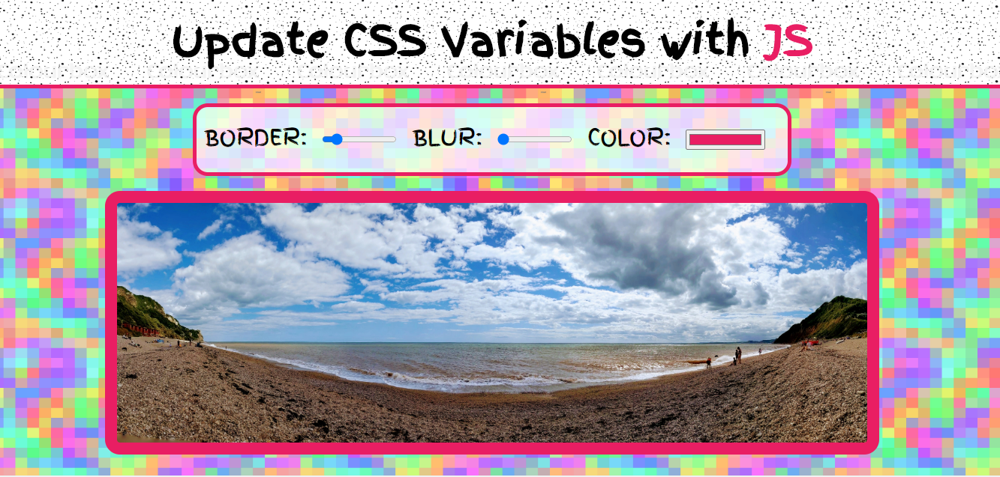

# Using CSS Variables With JavaScript

###### August 2020

_This is a litte app in which you can adjust the border width, color and blur of a photo. I made it as part of [Wes Bos' JavaScript30](https://wesbos.com/) course to practice using CSS variables and then updating them with JavaScript. I really enjoyed this little project and learnt lots!_

### Main Learning Points:

- I used the HTML range input and color input for the first time.
- I learnt that when you use `querySelector / querySelectorAll` it returns you a Node List which is very similar to an array except there are a lot less methods you can use on it. `forEach` _is_ one of the methods you can use on a Node List and I used this one today.
- I learnt that there is an `EventListener` called 'change'.
- I learnt that `document.documentElement` returns you the element which is the root element of the HTML document.
- I learnt how to update a CSS variable with JavaScript.
